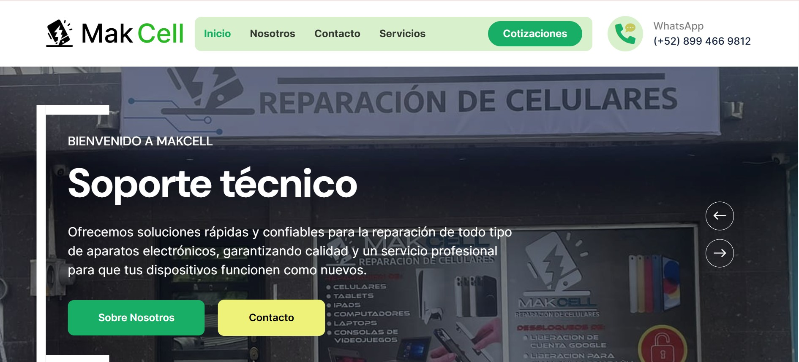
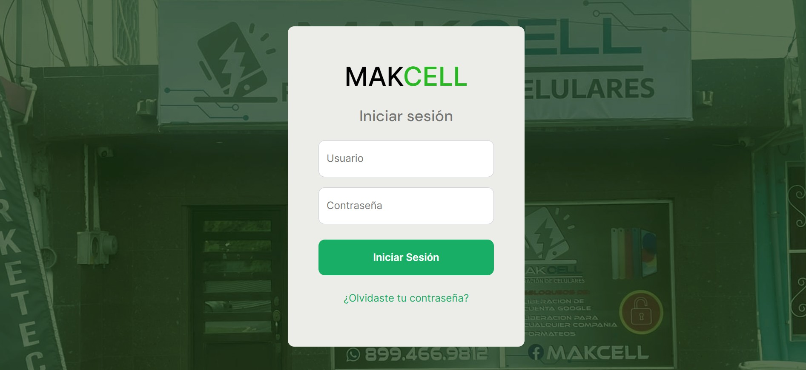
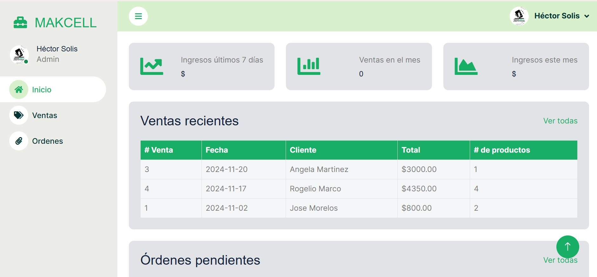
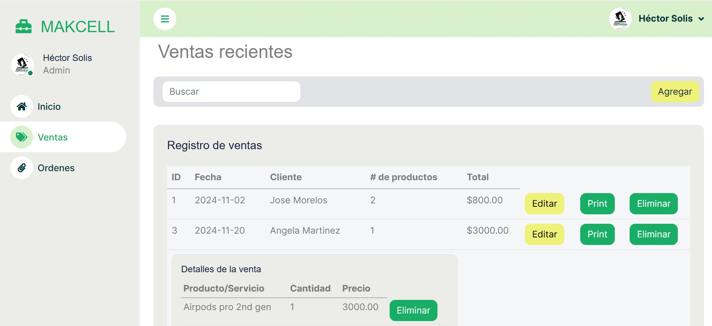
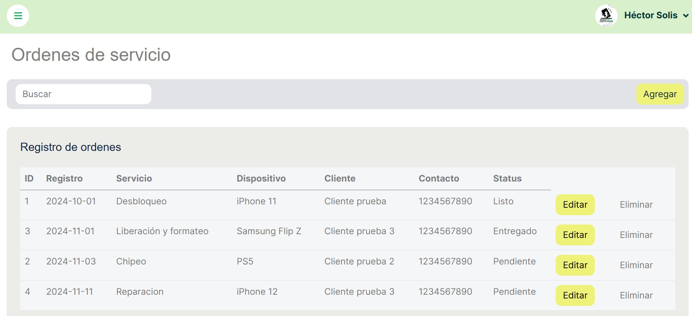

# 📱 Phone Repair Shop Web App

A simple web application for managing a phone repair shop.  
The website provides information about the shop and includes a secure login system for staff to log sales, repairs, and manage records.

---

## Features
- Public-facing website with shop information.  
- User authentication (login system).  
- Sales and repair logging system.  
- Dashboard for managing transactions.  
- MySQL database integration for persistent data storage.  

---

## Tech Stack
- **Frontend:** HTML, CSS, JavaScript  
- **Backend:** PHP  
- **Database:** MySQL  
- **Local Server:** XAMPP  

---

## Installation & Setup

1. **Clone the repository**
```bash
   git clone https://github.com/suselyt/MakCell-WebApp.git
```
2. **Move Project to XAMMP**
Place the project folder inside:
```bash
   C:\xampp\htdocs\
```
3. **Start XAMPP**
Run Apache and MySQL modules from the XAMPP Control Panel.
4. **Database Setup**
- Open [phpMyAdmin](http://localhost/phpmyadmin)
- Create a new database, e.g., phone_repair_shop.
- Import the provided .sql file located in /makcell3.sql.
5. **Access the app**
  Visit [http://localhost/MakCell-WebApp](http://localhost/MakCell-WebApp) in your browser.

---

## Default Login (for testing)

Username: makc311admin2
Password: 1234

---

## Screenshots


### Home Page


### Login Page


### Dashboard


### Sales


### Orders


---

## License

This project is licensed under the MIT License.
